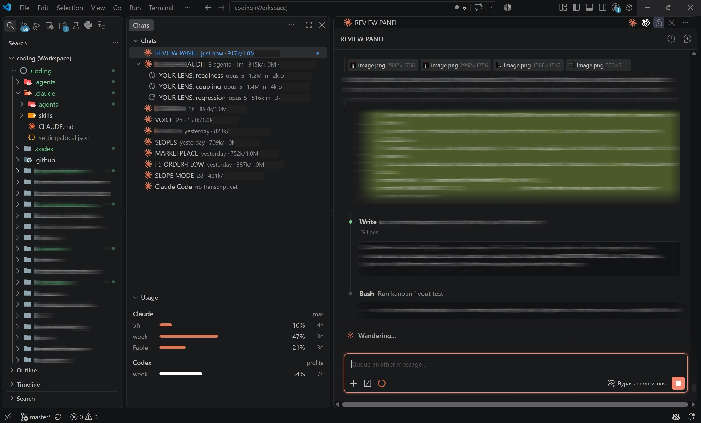

# Agent View

One panel for every AI chat in your VS Code window. Claude Code and Codex conversations become
rows in a tree view — live status, context size, API-equivalent cost, running subagents — with
your account's rate-limit windows drawn as bars above them.



## What the rows show

| Element | Meaning |
| --- | --- |
| `450k/1.0M` | Context in play vs the model's window — the last request's input + cache |
| `$12.34` | What the session's tokens (subagents included) would bill at list API rates. A Claude subscription is not billed this way; it is a what-if figure |
| blue `●` badge | The agent is working right now |
| orange `?` badge | The agent asked a question and is blocked on your answer |
| green `●` badge | The agent replied and you have not read it yet. Clears when you look at the tab, or when you reply |
| `⟳` child rows | Subagents whose transcripts were written in the last 2 minutes, with per-agent model, tokens and cost |
| `🕘` rows | Chats whose tab was closed; click to reopen the session |

Hover any row for the full breakdown (model, turns, cache reads/writes, reset times).

## Layout

On first run the extension moves the panel to the left of the editor and opens
itself there — files, then chats, then the chat you are working in. That is a
one-time move; drag things wherever you like afterwards. Two palette commands
cover the rest: **Agent View: Show Chats Panel** brings the view back if it
gets closed, and **Agent View: Arrange as Left Column** restores the layout.
*View: Move Panel to Bottom* undoes it.

## Buttons

Claude logo — new Claude chat as an editor tab. History icon beside it — reopen any past Claude
session. Codex logo — new Codex agent, placed next to your chats. Second history icon — open any
past Codex conversation in a tab. Refresh — re-read everything and refetch usage.

## When something looks wrong

**Agent View: Show Log** (command palette) opens a log of what the panel did —
activation, when the usage view was drawn, and every usage lookup with its
result and timing.

`Claude token expired` in the usage rows is normal after an idle stretch: the
stored token lasts 8 hours and only Claude Code renews it. The bars come back
by themselves within a second of your next Claude message.

## Requirements

- VS Code ≥ 1.90
- [Claude Code](https://marketplace.visualstudio.com/items?itemName=Anthropic.claude-code) extension, signed in
- [Codex (ChatGPT)](https://marketplace.visualstudio.com/items?itemName=openai.chatgpt) extension — optional; Codex rows and buttons appear only if present

## Install

Download the `.vsix` from [Releases](https://github.com/tuscheteam/agent-view/releases), then:

```sh
code --install-extension agent-view-*.vsix
```

Or in VS Code: Extensions view → `···` menu → *Install from VSIX…*

## Updating

Same command, any time — it replaces the installed version in place:

```sh
gh release download -R tuscheteam/agent-view -p "*.vsix" --clobber
code --install-extension agent-view-*.vsix
```

Sideloaded extensions do not auto-update. To hear about new versions, click
*Watch → Custom → Releases* on the repo.

## Remote-SSH

The extension runs where the chats run, so in a Remote-SSH window it has to be
installed on the remote. Either use the Extensions view → `···` → *Install from
VSIX…* while connected, or from a shell on the remote:

```sh
~/.vscode-server/bin/*/bin/code-server --install-extension agent-view-*.vsix
```

It then reads that machine's `~/.claude` and `~/.codex`, and shows only chats
running there.

## Settings

| Setting | Default | Effect |
| --- | --- | --- |
| `openEditorsTools.closedChatHours` | `48` | How long closed chats stay listed. `0` hides them |
| `openEditorsTools.recentFirst` | `false` | Move the editor you just activated to the top of its group |

## Privacy

Everything runs locally. Concretely, the extension:

- reads Claude Code's OAuth token from `~/.claude/.credentials.json` and sends it to exactly one
  endpoint, `https://api.anthropic.com/api/oauth/usage`, to fetch your own rate-limit numbers —
  the same call Claude Code's `/usage` makes;
- reads Claude session transcripts under `~/.claude/projects/` (local files);
- opens Codex's local thread database `~/.codex/state_5.sqlite` read-only, and spawns
  `codex app-server` locally to read rate limits — Codex handles its own credentials;
- caches usage for 5 minutes; sends nothing anywhere else.

## Trademarks

The Claude name and logo are trademarks of Anthropic, PBC. The ChatGPT/Codex name and logo are
trademarks of OpenAI. They are used here to identify those products; the logo files are not
covered by this project's MIT licence, and this project is not affiliated with or endorsed by
Anthropic or OpenAI.

## More

Design notes and the debugging history live in [docs/INTERNALS.md](docs/INTERNALS.md).
