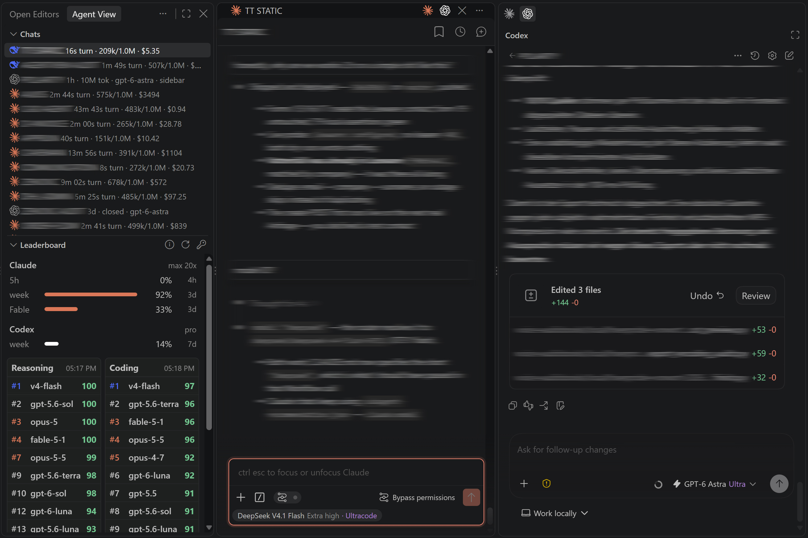

# Agent View

One panel for every AI chat in your VS Code window. Claude Code and Codex conversations become
rows in a tree view — live status, context size, API-equivalent cost, running subagents — with
your account's rate-limit windows drawn as bars above them.



## What the rows show

| Element | Meaning |
| --- | --- |
| `450k/1.0M` | Context in play vs the model's window — the last request's input + cache |
| `$12.34` | What the session's tokens (subagents included) would bill at list API rates. A Claude subscription is not billed this way; it is a what-if figure |
| blue `●` badge | The agent is working right now |
| orange `?` badge | The agent asked a question and is blocked on your answer |
| green `●` badge | The agent replied and you have not read it yet. Clears when you look at the tab, or when you reply |
| `⠹` child rows | Subagents working in the last 2 minutes, named by their spawn description, with model, total tokens, age and cost. Codex subagents appear the same way, named by the nickname Codex gave them |
| `🕘` rows | Chats whose tab was closed; click to reopen the session. A chat still running without a tab here reads "open elsewhere" |

Hover any row for the full breakdown (model, turns, cache reads/writes, reset times).

## Layout

On first run the extension moves the panel to the left of the editor and opens
itself there — files, then chats, then the chat you are working in. That is a
one-time move; drag things wherever you like afterwards. Two palette commands
cover the rest: **Agent View: Show Chats Panel** brings the view back if it
gets closed, and **Agent View: Arrange as Left Column** restores the layout.
*View: Move Panel to Bottom* undoes it. **Arrange Layout: Explorer | Agent View
| Claude | Codex** restores the full four-column layout in one click — Explorer
sidebar, then this panel, then a Claude group, then a Codex group.

VS Code remembers where each view was dragged, so a view added by an update can
land in a different panel than the ones you moved. **Agent View: Reset Views**
puts Chats, Usage and Leaderboard back into one panel; the extension runs it
once by itself after the update that added the Leaderboard.

`openEditorsTools.codexOpenTarget` decides where a Codex row opens: `sidebar`
loads the thread into the Codex sidebar panel, `editor` opens it as a tab in
the Codex column, and `auto` (the default) uses the sidebar panel when one is
open — including a Codex view dragged into the editor area — or when no Codex
editor tab exists yet, and opens an editor tab otherwise.

Right-click any Claude or Codex chat for **Open in Middle** and **Open in Side
Panel**. Open in Middle puts the chat in a tab in the Claude column. Open in
Side Panel moves it to the secondary side bar: a Codex chat loads into the Codex
sidebar, and a Claude chat goes to Claude Code's own sidebar view. A Claude chat
that has a tab loses that tab on the move, and a chat in the middle of a turn
asks first, because closing the tab stops the turn. A Claude chat that runs
without a tab in this window (the side panel, another window or a terminal)
shows "open elsewhere" and sorts with the open chats. Claude Code keeps a chat
its own side panel holds in that side panel: Open in Middle on such a chat
reveals the side panel and says so, because Claude Code has no command to move
a chat out of it.

## Buttons

Claude logo — new Claude chat as an editor tab. History icon beside it — reopen any past Claude
session. Codex logo — new Codex agent, placed next to your chats. Second history icon — open any
past Codex conversation in a tab. Refresh — re-read everything and refetch usage.

## Leaderboard

The Leaderboard panel shows AI Stupid Level's current OpenAI and Anthropic
models in two compact columns: reasoning and coding. It uses the free API tier
conservatively: five local-time refresh slots per day (`08:00`, `11:00`,
`14:00`, `17:00`, `20:00`), two calls per slot, with the calls spaced apart for
the 1/minute limit. Run **Agent View: Set AI Stupid Level API Key** once; the
key is stored in VS Code SecretStorage, not in settings. If VS Code keeps the
new view hidden after an update, run **Agent View: Show Leaderboard Panel**.

The rank colour names the provider: white for OpenAI, orange for Anthropic,
whose `claude-` prefix is dropped in the cell (hover a row for the full name),
and DeepSeek's logo blue for DeepSeek, whose `deepseek-` prefix is dropped the same way. Only the DeepSeek model the model router
serves is listed (`deepseek-v4-flash`), and only while the router is on;
`openEditorsTools.leaderboard.showDeepSeek` set to `always` or `never`
overrides that. Source, schedule, freshness and remaining quota sit behind the
view's info button.

VS Code gives every pane a 120 px minimum body, which leaves dead space under
the five Usage bars. Collapse the Usage pane (or hide it from its context
menu) and the bars move to the top of the Leaderboard pane, where they take
exactly the height they need; expand Usage again and they move back.

## Subagent recommendation

After every leaderboard refresh — and once at startup when a coding column is
already cached — the extension writes `~/.agent-view/subagent-recommendation.json`.
It names the best-scoring coding model per provider, one for Claude and one for
Codex, so an orchestrator picks its subagent model from the board instead of a
line in your memory that goes stale the next time the ranking moves.

`openEditorsTools.subagentExcludeModels` (default `["claude-fable-5-1",
"gpt-6-astra"]`) lists names the file never recommends — flagship models priced
for the orchestrator seat, not for fan-out. A change applies on the next
refresh, no reload. `openEditorsTools.subagentRecommendation.enabled` set to
`false` stops the file from being written. DeepSeek is never recommended.

Point your orchestrator at the file. One line in `CLAUDE.md` or `AGENTS.md`:

> For subagents, read `~/.agent-view/subagent-recommendation.json` and use
> `claude.model` (Claude orchestrator) or `codex.model` (Codex orchestrator) as
> the subagent model.

## Model router: OpenRouter models in Claude Code (optional, off by default)

With the router on, any Claude Code chat can switch to an OpenRouter model such as
DeepSeek V4 Flash through Claude Code's own model menu (`/model`), and back to Claude
in the same chat. Claude models keep using your Claude login; only the OpenRouter
model is billed to your OpenRouter account.

Setup:

1. Create a key at [openrouter.ai/settings/keys](https://openrouter.ai/settings/keys)
   and add credit.
2. Command palette → **Agent View: Set OpenRouter API Key**. The key lives in VS Code's
   secret storage. An `OPENROUTER_API_KEY` environment variable works too.
3. Command palette → **Agent View: Model Router: Turn On / Off**.
4. Open a new Claude chat (chats that were already open keep their old connection
   until reopened). The model menu now lists DeepSeek V4 Flash.

How it works: Agent View runs a small server on `127.0.0.1:47861` and points Claude
Code's VS Code chats at it (`ANTHROPIC_BASE_URL` in `claudeCode.environmentVariables`,
written only while the router answers). Requests for `claude-*` models pass through
to Anthropic unchanged. Requests for `vendor/model` names go to OpenRouter with:

- **zero data retention** required (`provider.zdr`), no training on prompts;
- providers headquartered in China, Hong Kong or Singapore excluded, and providers
  without a known headquarters, plus `openEditorsTools.modelRouter.ignoredProviders`;
- only providers that passed a live check: reasoning stays out of the answer, tool
  calls work, prompt cache hits. They are ordered by cost for coding work (mostly
  cache reads), and each chat stays on one provider so its cache stays warm. The
  check re-runs weekly in the background (a few cents).

When no provider qualifies, a request is refused with a message instead of
letting OpenRouter choose; **Model Router: Re-check OpenRouter Providers** runs
the check again. A provider that rejects a request another provider then serves is skipped on
this machine for 14 days. One that is only busy (HTTP 429 or 5xx) rests for five
minutes.

Web search in a DeepSeek chat runs on Claude (`claude-sonnet-5`), because only
Anthropic can run that server tool. In the Chats panel a chat whose current model
is DeepSeek shows the DeepSeek logo, and its cost is the amount OpenRouter actually
billed. **Model Router: Status** shows the port, key, provider order and the last
requests; **Model Router: Re-check OpenRouter Providers** re-runs the check.

Limits and trade-offs:

- Picking a model from Claude Code's model menu can write it into
  `~/.claude/settings.json` as the global default, and every chat that sits on
  "Default" follows it — chats you never switched then run DeepSeek too. Agent
  View guards against that: when a menu pick makes an OpenRouter model the
  global default, the previous default is put back and a message says so, while
  the chat the pick was made in keeps its model
  (`openEditorsTools.modelRouter.defaultModelGuard`, on by default). The
  `/model <id>` command applies to that session only.
- A wrong or expired OpenRouter key comes back as a clear message, never as a
  Claude login prompt.

- DeepSeek V4.1 Flash reads images and PDFs. A bare `deepseek` subagent model id resolves to it at the router.
  with a tool) reach it as a one-line note; switch to a Claude model to look at them.
- With any base URL other than Anthropic's, Claude Code sends the full conversation
  with every request, for Claude models too. The prompt cache keeps the cost the
  same; uploads are larger.
- When Claude Code already uses another gateway, Bedrock, Vertex or Foundry
  (`ANTHROPIC_BASE_URL` or `CLAUDE_CODE_USE_*` in VS Code's environment, in the
  `env` block of `~/.claude/settings.json`, or in `claudeCode.environmentVariables`),
  the router stays out and says so once.

Turning the router off, closing VS Code or uninstalling Agent View removes the
environment entry and the model menu rows, so Claude Code falls back to talking
to Anthropic directly. A `claude` started in a terminal never goes through the
router.

### Switching it all off

Every feature beyond the chat list has a switch in Settings (search
`openEditorsTools`). For a setup without DeepSeek: leave
`modelRouter.enabled` off, and the leaderboard shows no DeepSeek row
(`leaderboard.showDeepSeek` `auto`). Set `leaderboard.showDeepSeek` to
`never` to hide it even while the router runs.

## Quiet timeline (optional)

**Agent View: Restyle Claude Panel** collapses Claude Code's chat timeline the
way Codex renders it: tool cards (Bash IN/OUT, Write bodies) hidden, thinking
rows hidden, and only each turn's final message visible, with roomier line
spacing. It patches the stylesheet inside your installed Claude Code extension
(a `.bak` sits beside it) and re-applies itself after Claude Code updates.
**Agent View: Restore Claude Panel** puts everything back. Reload the window
after either.

How much Claude *writes* per reply is Claude Code configuration, not something
an extension can reach — see [docs/REPLY-SETUP.md](docs/REPLY-SETUP.md) for
the output style, CLAUDE.md rule and optional length hook that pair with this.

## When something looks wrong

**Agent View: Show Log** (command palette) opens a log of what the panel did —
activation, when the usage view was drawn, and every usage lookup with its
result and timing.

**Agent View: Log Open Tabs** writes one line per open tab — label, input kind
and whether the scan recognised it as Claude or Codex — into that same log.

If renames stop working after a Claude Code update, the extension re-patches
the broken call sites automatically at the next reload. To run the patch
manually, use **Agent View: Repair Claude Code Patches**; to undo it, use
**Agent View: Undo Claude Code Patches**.

Codex chat names come from `~/.codex/session_index.jsonl`, the log Codex's own window
reads, and fall back to the database only for threads the log does not name.
A chat you renamed in Codex keeps that name here even after you resume it.

`Claude token expired` in the usage rows is normal after an idle stretch: the
stored token lasts 8 hours and only Claude Code renews it. The bars come back
by themselves within a second of your next Claude message.

## Install or update

One command per OS. It installs Agent View the first time and replaces an older
copy in place, so "already installed" needs no different line.

**macOS / Linux** (Terminal):

```sh
curl -sL -o /tmp/agent-view.vsix https://github.com/tuscheteam/agent-view/releases/latest/download/agent-view-latest.vsix && code --install-extension /tmp/agent-view.vsix --force
```

**Windows** (PowerShell):

```powershell
iwr https://github.com/tuscheteam/agent-view/releases/latest/download/agent-view-latest.vsix -OutFile $env:TEMP\agent-view.vsix; code --install-extension $env:TEMP\agent-view.vsix --force
```

If `code` is not on your PATH:

- macOS: `/Applications/Visual Studio Code.app/Contents/Resources/app/bin/code` — or run
  *Shell Command: Install 'code' command in PATH* from the command palette once.
- Windows: `& "$env:LOCALAPPDATA\Programs\Microsoft VS Code\bin\code.cmd"`.
- VSCodium, Insiders: same path with the variant's folder name.

Then reload the window: command palette (`Cmd/Ctrl+Shift+P`) → *Developer: Reload
Window*. No terminal? Download `agent-view-latest.vsix` from
[Releases](https://github.com/tuscheteam/agent-view/releases) and use the
Extensions view → `···` → *Install from VSIX…*.

Sideloaded extensions do not auto-update. Click *Watch → Custom → Releases* on
the repo to hear about new versions.

### First run

1. Command palette → **Agent View: Set OpenRouter API Key**. The key is the
   friend's own (a shared key bills the owner).
2. **Agent View: Model Router** on (Config → `openEditorsTools.modelRouter.enabled`).
   Chats opened from then on list the DeepSeek models in `/model`.
3. If the "deepseek subagents" offer appears, choose **Re-apply**. It patches
   Claude Code's own binary once per Claude Code version.
4. Open the Agent View panel: View → Open View… → *Agent View*, or click the
   icon in the panel bar.

### Uninstall

Removes the Claude Code environment entries, the model-menu rows and the
subagent patch (standard VS Code, Insiders and VSCodium installs).

## What to know before you start

- **A chat's model resets to your global default after a window reload or restart.**
  Claude Code keeps no model per chat: `/model <id>` applies to the running chat, and
  a chat the window restores starts on the default again. Re-run `/model` in the chats
  where you want DeepSeek. The Chats panel shows the model a chat runs on now, and its
  tooltip prints the exact `/model` line to switch back.
- **Subagents get a default model of their own** while the router is on
  (`modelRouter.subagentModel`, the cheap DeepSeek flash). A chat that names a model,
  an Opus reviewer in a Claude chat for example, keeps it. Turn on
  `modelRouter.forceSubagentModel` when nothing may bill to Claude: every subagent then
  runs the DeepSeek model, whatever a chat asks for.
- **Switching a chat between Claude and DeepSeek keeps the whole history.** One
  transcript per chat; each request carries it to whichever model is current. Two
  details differ: thinking blocks are not shared across providers (Claude's signed
  blocks stay with Claude, DeepSeek's stay with DeepSeek), and a model that cannot read
  images gets a one-line note in place of each image for that request. The transcript
  keeps the original, so switching back to a Claude model shows the image again.
- **DeepSeek V4.1 Flash reads images and PDFs**; the cheaper 0731 flash used for
  subagents reads text only.
- **Your own OpenRouter key.** A shared key bills its owner.
- **The DeepSeek subagent option needs a patch** to Claude Code's own binary, which
  each Claude Code update removes; Agent View offers the re-apply while the router runs.
- **Sideloaded, so it does not auto-update.** Watch the repo's releases.

## Requirements

- VS Code ≥ 1.90
- [Claude Code](https://marketplace.visualstudio.com/items?itemName=Anthropic.claude-code) extension, signed in
- [Codex (ChatGPT)](https://marketplace.visualstudio.com/items?itemName=openai.chatgpt) extension — optional; Codex rows and buttons appear only if present

## DeepSeek chats and subagents

Two DeepSeek models sit in Claude Code's model menu while the router is on:

- **DeepSeek V4.1 Flash** reads images and PDFs. Use it for chats.
- **DeepSeek V4 Flash 0731** is cheaper and text-only. A subagent requested as
  plain `deepseek` runs on it.

Claude Code keeps no model per chat. A pick from the model menu becomes the
global default (Agent View puts the previous default back, see
`modelRouter.defaultModelGuard`), and a chat that a window reload restores
starts on that default again. The Chats panel shows the model a chat runs on
now. Its tooltip names the last reply's model and the `/model` command that
switches back.

`deepseek` as a subagent model needs a small patch to Claude Code's own
binary, because the Agent tool accepts only a fixed list of model names. Every
Claude Code update ships a fresh binary without the patch. While the router is
on, Agent View notices this after an update and offers to re-apply it once per
version. The palette commands **Agent View: Claude Code: Check DeepSeek Subagent
Patch** and **Re-apply DeepSeek Subagent Patch** do the same on demand.

The patch swaps one string in place: the Agent tool's model list
`sonnet, opus, haiku, fable` becomes `deepseek, opus, haiku`, so subagents can no
longer ask for sonnet or fable. The other copies of that list in the binary stay
untouched, and the result is verified after writing. The new binary is written
next to the old one and renamed into place, so open chats keep the old binary
until they are reopened. On macOS it gets an ad-hoc signature first. Undoing
writes the original list back (`node tools/patch-claude.cjs --undo`), and
uninstalling Agent View does the same. Patching Anthropic's file is a
workaround: Anthropic support does not cover a patched binary.

## Remote-SSH

The extension runs where the chats run, so in a Remote-SSH window it has to be
installed on the remote. Either use the Extensions view → `···` → *Install from
VSIX…* while connected, or from a shell on the remote:

```sh
~/.vscode-server/bin/*/bin/code-server --install-extension agent-view-*.vsix
```

It then reads that machine's `~/.claude` and `~/.codex`, and shows only chats
running there.

## Settings

| Setting | Default | Effect |
| --- | --- | --- |
| `openEditorsTools.codexClosedDays` | `30` | Codex chats quiet for this many days collapse into one "older Codex chats hidden" row (click it to show all). `0` lists every Codex chat |
| `openEditorsTools.closedChatHours` | `48` | How long closed chats stay listed. `0` hides them |
| `openEditorsTools.recentFirst` | `false` | Move the editor you just activated to the top of its group |
| `openEditorsTools.codexOpenTarget` | `auto` | Where a Codex row opens: `sidebar` panel, `editor` tab, or `auto` |
| `openEditorsTools.chats.showBackgroundTasks` | `true` | Spinner rows for background shells, agents, workflows and monitors a chat waits on |
| `openEditorsTools.chats.showCrossProviderSubagents` | `true` | Codex runs started from a Claude chat (and the reverse) as subagent rows |
| `openEditorsTools.leaderboard.showDeepSeek` | `auto` | DeepSeek row on the leaderboard: `auto` (while the router is on), `always`, `never` |
| `openEditorsTools.subagentRecommendation.enabled` | `true` | Write `~/.agent-view/subagent-recommendation.json` |
| `openEditorsTools.subagentExcludeModels` | `["claude-fable-5-1", "gpt-6-astra"]` | Models never recommended as subagents |
| `openEditorsTools.claudeCodeAutoRepair` | `true` | Re-apply the chat-rename fix to new Claude Code installs at startup |
| `openEditorsTools.modelRouter.enabled` | `false` | Run the model router (OpenRouter models in Claude Code) |
| `openEditorsTools.modelRouter.pickerModels` | `["deepseek/deepseek-v4.1-flash", "deepseek/deepseek-v4-flash-0731"]` | OpenRouter models listed in Claude Code's model menu |
| `openEditorsTools.modelRouter.requireZeroDataRetention` | `true` | `false` also admits non-ZDR providers into the ranking and probes (re-check provider order for it to take effect) |
| `openEditorsTools.modelRouter.ignoredProviders` | Chinese / HK / SG providers | OpenRouter provider slugs never used |
| `openEditorsTools.modelRouter.subagentModel` | `deepseek/deepseek-v4-flash-0731` | Default model for a subagent that does not name one |
| `openEditorsTools.modelRouter.forceSubagentModel` | `false` | Force every subagent onto that model, ignoring a named model |
| `openEditorsTools.modelRouter.port` | `47861` | Local router port |
| `openEditorsTools.modelRouter.serverToolModel` | `claude-sonnet-5` | Claude model that runs web search for OpenRouter chats |

## Privacy

Everything runs locally. Concretely, the extension:

- reads Claude Code's OAuth token from `~/.claude/.credentials.json` and sends it to exactly one
  endpoint, `https://api.anthropic.com/api/oauth/usage`, to fetch your own rate-limit numbers —
  the same call Claude Code's `/usage` makes;
- reads Claude session transcripts under `~/.claude/projects/` (local files);
- opens Codex's local thread database `~/.codex/state_5.sqlite` read-only, and spawns
  `codex app-server` locally to read rate limits — Codex handles its own credentials;
- sends your AI Stupid Level API key only to `https://aistupidlevel.info/api/v1/models`
  for the reasoning and coding leaderboard calls — one fetch per time slot across all
  your windows (windows share `~/.agent-view/leaderboard-cache.json`), so the free
  tier's ten daily calls are never exceeded by having two windows open;
- caches usage for 5 minutes;
- with the model router on: passes Claude requests to `api.anthropic.com` unchanged, sends
  requests for OpenRouter models with your OpenRouter key to `openrouter.ai`, reads
  OpenRouter's public provider lists and model cards, sends short test prompts (arithmetic
  and a weather tool call, about one cent per check) when it re-checks providers, and logs
  per-reply costs to `~/.agent-view/router-usage.jsonl` and provider checks to
  `~/.agent-view/router-providers.json`; `~/.agent-view/router-secret` lets the routers of
  several VS Code windows recognise each other. Your Claude login is never sent to OpenRouter;
- sends nothing anywhere else.

## Trademarks

The Claude name and logo are trademarks of Anthropic, PBC. The ChatGPT/Codex name and logo are
trademarks of OpenAI. The DeepSeek name and logo are trademarks of DeepSeek; the logo file comes
from LobeHub's icon set. They are used here to identify those products; the logo files are not
covered by this project's MIT licence, and this project is not affiliated with or endorsed by
Anthropic, OpenAI or DeepSeek.

## More

Design notes and the debugging history live in [docs/INTERNALS.md](docs/INTERNALS.md).
